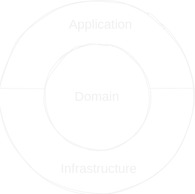

# Lightweight Clean Architecture  Example
## Description
This example use a very lightweight Onion Architecture and Domain Driven Design.
### Overview

  

### Layers
<b>1. Domain Layer</b> 
This Layer contains <b><i>Aggregates</i></b>, <b><i>Domain Entities</i></b>, <b><i>Value Objects</i></b>. Each Aggregate is isolated and has no dependencies to other Aggregates.
Each <b><i>Aggregate Root</i></b> has a list of <b><i>Domain Events</i></b> and <b><i>Integration Events</i></b>.
<b><i>Domain Events</i></b> live in a transaction scope inside the application. <b><i>Integration Events</i></b> are not implemented yet and should raise events on a middleware.

<b>2. Application Layer</b> 
<b>2.1 Controller:</b> REST-Controller and <b><i>Models</i></b> for providing REST Operations. <b><i>Controllers</i></b> can access <b>Repositories</b> for reading data. In this example, changes get published as <b><i>Application Events</i></b> 
<b>2.2 EventListener:</b>Handles <b><i>Application Events</i></b> (and in future can also handle Integration Events). Use Repositories to read / store data.

<b>3. Infrastructure Layer</b> 
Holds Infrastructure. In this example there are JPA Repositories for storing and reading data in a H2 database. Could also have infrastructure for ex. publishing events on a middleware, access 3rd party systems etc.

### Testing
There are two kind of tests
  1. Unit Tests
  2. Architecture Tests -> fitness functions to test the structure of the architecture

## Links

Swagger-UI: http://localhost:8080/swagger-ui/index.html

H2-Console: http://localhost:8080/h2-console
